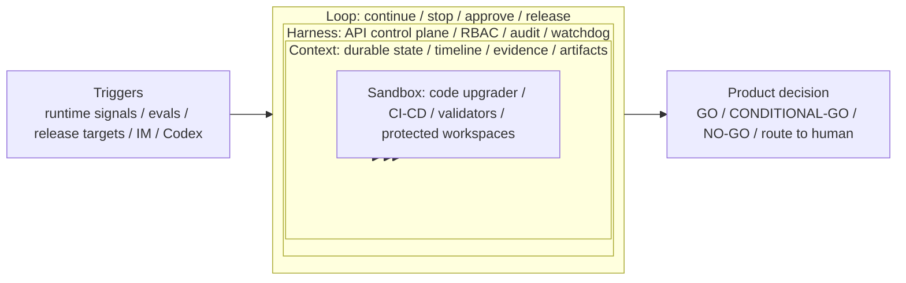

# EvoPilot

> GA Release V1.0: evidence-driven self-evolution control plane for AI agent products, with Loop Engineering, human-approved code upgrades, CI/CD, and product-native release decisions.

[](https://nodejs.org/)
[](https://www.typescriptlang.org/)
[](#运行模式)
[](#控制台)
[](#ga-release-v10)

EvoPilot observes real AI-agent product behavior, turns evidence into reviewable evolution opportunities, waits for human approval, then drives Loop Runtime execution, code upgrades, Jenkins/GitLab delivery, release evidence, and auditable `GO` / `NO-GO` decisions.

It is not an agent runtime, a prompt playground, or a generic code generator. Agent runtimes do the work; EvoPilot governs whether the product is ready to evolve and release.

## Status

EvoPilot is marked **GA Release V1.0** for its product control plane and Loop Engineering runtime. The release standard is not a health-only soak: the GA target requires production-representative projects, successful evolution loops, code-upgrader changes, Jenkins/GitLab delivery, residual scenarios, active workload stability, and product-native `GO` / `NO-GO` release evidence.

The authoritative release verdict lives in:

```http
GET /api/v1/release/decisions
```

## Core Capabilities

| Capability | What EvoPilot provides |
|---|---|
| Continuous evolution control plane | Product-facing layers for evidence, decision, execution, governance, and continuity. |
| Loop Engineering | Durable Loop Runtime, typed executor graphs, ExecutorAdapter plugins, Dashboard orchestration presets, target-loop backlog, Codex target autopilot, replay with human context edits, sandbox enforcement evidence, worker leases, watchdog recovery, loop traces, and Dashboard timeline. |
| Evidence ingestion | Runtime events, OpenTelemetry traces/logs, SkyWalking data, evaluation results, and user feedback. |
| Opportunity discovery | Evidence clustering, failure attribution, dynamic baselines, scorecards, SLOs, and governance rules. |
| Human approval | Markdown evolution proposals that users can review and edit before execution. |
| Code upgrades | A code-upgrader runtime that creates branches, commits implementation changes, and returns review evidence. |
| CI/CD delivery | Jenkins-backed delivery after successful code upgrades, with pipeline status and artifacts retained. |
| Release governance | Product-native release targets, evidence bundles, scenario matrices, risk registers, and release decisions. |
| ProofOps target loops | Target-driven release/maturity loops that create a target plan, require plan approval, collect evidence, emit a ProofOps-compatible final report, and gate release actions behind approval. |
| Source-to-production closure | Every target loop carries `sourceClosure`, and GitHub/GitLab projects can execute SCM closure through branch creation, file commits, PR/MR creation, tags, deploy URL evidence, and health/ready probes. |

## Loop Engineering Product Model

EvoPilot applies the Loop Engineering idea to AI Agent product evolution: long-running work must run inside execution boundaries, keep durable context, stay under product governance, and move through an explicit continue / stop / approve loop. The goal is not to expose a generic agent framework, but to make real product evolution recoverable, auditable, and releasable.

The Loop Engineering layered model, `Sandbox -> Context -> Harness -> Loop`, maps to EvoPilot this way:

| Loop Engineering layer | Product design question | EvoPilot capability |
|---|---|---|
| Sandbox | Where can executors safely work, and what boundaries prevent unsafe product changes? | host/Docker/K8s sandbox policy, credential scope, network mode, allowed/denied paths, per-step workspaces, code-upgrader runtime, protected paths, Jenkins/GitLab delivery boundaries, production mode checks |
| Context | What state, evidence, artifacts, and intermediate results survive across rounds? | durable `LoopRun` state, file/SQLite/Postgres store contract, replay context patch, timeline, evidence sets, artifacts, project profile, evaluation datasets, release evidence |
| Harness | Who controls the run, what must be approved, and how are failures recovered? | API control plane, RBAC, approval gates, audit records, worker lease locks, idempotent recovery, watchdog, retry/stop policy, structured logs |
| Loop | When does the task continue, stop, retry, route to humans, or produce a release decision? | trigger rules, resume/cancel/approve APIs, release targets, ProofOps target loops, `GO` / `CONDITIONAL-GO` / `NO-GO` decisions |

This is the design center for EvoPilot V1.0: let Agent-product evolution run for long tasks without losing context, bypassing governance, or mistaking executor progress for product readiness.



## Quick Start

```bash
npm install
npm run build
npm run server:debug
```

Open the dashboard:

```text
http://127.0.0.1:19876/
```

Debug mode is for local development and UI validation. Production mode is the default for real operation and requires authentication plus real LLM/runtime boundaries.

## GA Release Target

The built-in `ga` release target requires:

| Criterion | Default |
|---|---:|
| Connected production-representative projects | 5 |
| Active successful soak duration | 5400 seconds |
| Active workload run delta | 5 |
| Active code-upgrade delta | 5 |
| Active CI/CD pipeline delta | 5 |
| Successful runs, evolution batches, code upgrades, and pipelines | 5 each |
| Required release scenarios | 10 |

Run the active stability proof:

```bash
npm run release:soak:ga:active
```

Generate release evidence:

```http
POST /api/v1/release/evidence
```

The latest decision can return `GO`, `CONDITIONAL-GO`, or `NO-GO`, with per-criterion evidence.

## Loop Runtime

EvoPilot now has a first-class Loop Runtime for Loop Engineering. It is the continuity and execution substrate of the continuous evolution control plane: long-running agent-product tasks can be triggered from API, Codex, IM, schedules, runtime signals, release targets, or evolution batches, then advanced through durable run state, executor graphs, independent evidence sets, stop/retry policy, heartbeat leases, watchdog recovery, human approval, and timeline audit.

Run the integrated gate:

```bash
npm run loop-runtime:check
npm run loop:soak
```

Primary API flow:

```http
POST /api/v1/executor-graphs
POST /api/v1/loops
POST /api/v1/loops/{loopId}/start
POST /api/v1/loops/{loopId}/resume
POST /api/v1/loops/{loopId}/replay
GET /api/v1/loops/{loopId}/checkpoints
POST /api/v1/loops/{loopId}/time-travel/replay
POST /api/v1/loops/{loopId}/approve
GET /api/v1/loops/{loopId}/timeline
GET /api/v1/loops/{loopId}/evidence
GET /api/v1/loops/{loopId}/trace
GET /api/v1/loops/{loopId}/trace-tree
GET /api/v1/loops/{loopId}/events
GET /api/v1/loops/{loopId}/sandbox-proof
POST /api/v1/loops/{loopId}/sandbox-proof/verify
GET /api/v1/loop-store
GET /api/v1/loop-observability
POST /api/v1/loop-workers/heartbeat
GET /api/v1/loop-workers/queue
POST /api/v1/loop-workers/claim
GET /api/v1/loop-orchestration/presets
GET /api/v1/loop-orchestration/targets
POST /api/v1/loop-orchestration/advance
POST /api/v1/loop-orchestration/instantiate
POST /api/v1/loops/watchdog
POST /api/v1/im/feishu/webhook
POST /api/v1/im/wecom/webhook
```

The runtime is the common substrate for continuous product evolution, release readiness loops, Codex commands, and IM adapters. Release and other high-risk actions stay inside the loop, but they are guarded by explicit approval gates. The same substrate is used when EvoPilot manages `evopilot-self`: target-loop work is tracked in EvoPilot, code-upgrader/Codex acts as an executor, and GitHub/ECS delivery evidence is written back to the loop instead of living only in an external terminal transcript.

Every target loop also has a source-to-production closure state machine. When a loop is created, EvoPilot records `sourceClosure`: the registered source project, repository provider, Git URL or server-local root, source branch, target version, release strategy, required gates such as `code-change`, `push`, `tag`, `deploy`, `health-ready`, and deployment environment. If the caller does not provide it, EvoPilot derives it from the registered project.

For GitHub, GitLab, and local Git repositories, an admin can execute the closure through `POST /api/v1/loops/{loopId}/source-closure/execute` or the Dashboard “执行闭环” action. EvoPilot creates a release branch, commits requested files, opens a PR or MR for remote providers, creates a tag when the loop requires `tag`, invokes a configured deploy connector for the `deploy` gate, probes health/ready URLs, and writes `closureState`, `gateEvidence`, commit/tag/PR/MR/deployment artifacts, audit records, and independent evidence back into `LoopRun.sourceClosure`. Each execution also creates an auditable `evopilot-source-release-closure-run/v1` record that exposes the release stages, review status, release policy status, auto-merge status, post-merge deployment status, merge status, next action, capabilities, source ref, artifacts, and status through `GET /api/v1/source-release-runs`, `GET /api/v1/loops/{loopId}/source-release-runs`, and `GET /api/v1/loops/{loopId}/source-closure/plan`. `POST /api/v1/loops/{loopId}/source-closure/review-decision` records release approval or rejection, evaluates policy gates before merge, blocks unsafe merges with persisted blocker evidence, can run safe `auto-merge`, and merges the GitHub PR, GitLab MR, or local release branch back to the source branch while persisting the merge commit, reviewer evidence, and post-merge deploy/health result. The release states distinguish planned, code changed, pushed, tagged, deployed, health-ready, health-failed, rolled-back, promoted, and failed outcomes, so a rollout that is reverted after health failure is not reported as a promoted release. This is a real SCM and deployment boundary, not only metadata. Built-in deploy connectors cover HTTP webhooks and bounded ECS Docker Compose rollouts with deploy locks, idempotency stamps, compose-failure rollback, post-deploy health-ready rollback, and post-merge deployment closure; K8s/cloud-specific deployers can be attached through the same connector contract.

The Dashboard also exposes a closed-loop orchestration workbench. `GET /api/v1/loop-orchestration/presets` lists productized loop presets, and `POST /api/v1/loop-orchestration/instantiate` creates a standard source-to-production target loop with a typed executor graph, Docker sandbox enforcement evidence, worker/watchdog continuity, deploy connector binding, and health-ready rollback semantics. `GET /api/v1/loop-orchestration/targets` exposes the product target backlog across Sandbox, Context, Harness, and Loop layers; `POST /api/v1/loop-orchestration/advance` creates or advances the next Codex-backed target loop, records next action and stop condition, and keeps acceptance criteria as loop context. Executor graphs now preserve typed edges, conditional routes, fan-out/fan-in edges, nested subgraph markers, and schema validation evidence in the graph contract.

The same Dashboard page now includes reusable product workbenches for the remaining loop-harness gaps. Release Closure Runtime reads source-release run records, refreshes the current source-to-production plan from `GET /api/v1/loops/{loopId}/source-closure/plan`, and exposes approve, merge, and safe auto-merge controls backed by `POST /api/v1/loops/{loopId}/source-closure/review-decision`; the view shows policy blockers and post-merge deployment status before an operator promotes a release. Context Time Travel lists checkpoints from `GET /api/v1/loops/{loopId}/checkpoints`, lets an operator edit context JSON, and submits `POST /api/v1/loops/{loopId}/time-travel/replay` to continue from the selected iteration with a replay diff. Worker Queue Workbench uses `GET /api/v1/loop-workers/queue` and `POST /api/v1/loop-workers/claim` to show claimable loops, active or expired leases, crash-resume readiness, and duplicate source-closure side-effect protection. Sandbox Boundary Workbench exposes executable Docker/K8s boundary proof through `GET /api/v1/loops/{loopId}/sandbox-proof` and writes verification evidence through `POST /api/v1/loops/{loopId}/sandbox-proof/verify`. Streaming Trace Workbench uses `GET /api/v1/loops/{loopId}/trace-tree` and `GET /api/v1/loops/{loopId}/events` for trace tree, checkpoint, cost, failure-group, replay-diff, sandbox-proof, and SSE event inspection.

## Self-Hosted Improvement Loop

EvoPilot can register an EvoPilot checkout or remote EvoPilot repository as an EvoPilot-managed target project and create a bounded self-improvement loop:

```bash
EVOPILOT_API_TOKEN=<admin-token> npm run self-loop
```

By default this command only performs controlled setup:

- registers `evopilot-self` through `POST /api/v1/projects` with a verified repository.
- ingests a real improvement signal through `POST /api/v1/evidence/events`.
- creates `evopilot-self-executor-adapter-contract` through `POST /api/v1/loops`.
- records allowed paths, validation commands, non-goals, and the human approval boundary in loop context.

It does not mutate the running controller process by itself. Source release closure is now an explicit admin action: after the loop produces reviewable files or a Dashboard user triggers the closure action, EvoPilot can write to GitHub/GitLab through the registered repository credentials and record branch/commit/PR/MR/tag/health evidence. To start exactly one Loop Runtime iteration after setup, opt in explicitly:

```bash
EVOPILOT_API_TOKEN=<admin-token> EVOPILOT_SELF_LOOP_START=1 npm run self-loop
```

Useful overrides:

| Variable | Default | Purpose |
|---|---|---|
| `EVOPILOT_BASE_URL` | `http://127.0.0.1:19876` | EvoPilot control-plane URL. |
| `EVOPILOT_SELF_REPOSITORY_PROVIDER` | `local-git` | Target repository provider: `local-git`, `github`, or `gitlab`. |
| `EVOPILOT_SELF_REPO_ROOT` | current working directory | Target checkout to register. |
| `EVOPILOT_SELF_PROJECT_ID` | `evopilot-self` | Project id for the self-hosted target. |
| `EVOPILOT_SELF_LOOP_ID` | `evopilot-self-executor-adapter-contract` | Loop id, useful when starting a fresh candidate loop. |
| `EVOPILOT_SELF_GITHUB_OWNER` / `EVOPILOT_SELF_GITHUB_REPO` | none | GitHub target owner and repository when `EVOPILOT_SELF_REPOSITORY_PROVIDER=github`. |
| `EVOPILOT_SELF_GITHUB_TOKEN_REF` | none | Environment variable name available to the EvoPilot server, used to verify the GitHub target. |
| `EVOPILOT_SELF_GITLAB_BASE_URL` / `EVOPILOT_SELF_GITLAB_PROJECT_ID` | none | GitLab target coordinates when `EVOPILOT_SELF_REPOSITORY_PROVIDER=gitlab`. |
| `EVOPILOT_SELF_GITLAB_TOKEN_REF` | none | Environment variable name available to the EvoPilot server, used to verify the GitLab target. |

For a production server managing this repository, register the remote GitHub target instead of a Mac-local path:

```bash
EVOPILOT_BASE_URL=https://evopilot.example.com \
EVOPILOT_API_TOKEN=<admin-token> \
EVOPILOT_SELF_REPOSITORY_PROVIDER=github \
EVOPILOT_SELF_GITHUB_OWNER=yeliang-wang \
EVOPILOT_SELF_GITHUB_REPO=EvoPilot \
EVOPILOT_SELF_GITHUB_TOKEN_REF=GITHUB_TOKEN \
npm run self-loop
```

`GITHUB_TOKEN` must be configured in the EvoPilot server environment, because repository validation is executed by the server.

## ProofOps Target Loop Mode

EvoPilot includes ProofOps Mode as a target-driven release/maturity loop engine. ProofOps remains the Core contract layer for target presets, evidence matrix vocabulary, non-mock evidence rules, and final report compatibility; EvoPilot owns execution, state, approval, audit, remediation, and release actions.

Run the integrated gate:

```bash
npm run proofops-mode:check
```

Primary API flow:

```http
POST /api/v1/conversations/commands
POST /api/v1/target-loops
POST /api/v1/target-loops/{loopId}/approve-plan
POST /api/v1/target-loops/{loopId}/resume
GET /api/v1/target-loops/{loopId}/final-report
POST /api/v1/target-loops/{loopId}/route-remediation
POST /api/v1/target-loops/{loopId}/release-actions/{action}/approve
POST /api/v1/target-loops/{loopId}/release-actions/{action}/execute
POST /api/v1/loops/{loopId}/source-closure/execute
```

Codex, Feishu, WeCom, and future IM adapters should use `/api/v1/conversations/commands` as the conversation gateway backend. Release actions are part of the ProofOps target loop, but require approval after `GO` and explicit execution after approval.

## GitHub About

Suggested repository description:

```text
GA Release V1.0 self-evolution control plane for AI agent products: Loop Engineering, evidence, human-approved code upgrades, CI/CD, and release decisions.
```

Suggested topics:

```text
ai-agents, agentops, loop-engineering, release-governance, evidence, cicd, llmops, self-evolution, typescript
```

## 产品闭环

```text
项目注册
-> 证据上报
-> 证据聚类 / 失败归因 / 动态基线
-> 自学习评测集 / 机会洞察
-> 证据策略触发
-> 评测集沉淀
-> 多评测集形成机会点
-> LLM 生成 Markdown 进化方案
-> 用户查看并修改方案
-> 用户确认进化
-> 代码升级执行器创建分支 / 提交 / MR 或 PR
-> 外部 Jenkins CI/CD 连接器
-> SLO / 成本 / 供应链 / 发布就绪度门禁验证
-> 历史记录 / 审计 / 规则学习
```

## 快速体验

安装依赖并构建：

```bash
npm install
npm run build
```

本地调试模式启动服务：

```bash
npm run server:debug
```

打开控制台：

```text
http://127.0.0.1:19876/
```

调试模式用于本地开发和页面验证，会允许样例数据、模板兜底和本地模拟集成。生产模式不要使用 `server:debug`。

## 控制台

Dashboard 位于 `apps/dashboard/`，当前一级菜单包括：

| 菜单 | 用途 |
|---|---|
| 首页 | 展示 APM 风格进化观测图，查看接入项目与证据流拓扑。 |
| 接入项目 | 注册 GitLab、GitHub 或本地 Git 项目，查看项目成熟度 Scorecard，验证通过后进入下游流程。 |
| 证据策略 | 用自然语言定义进化触发规则，系统编译并落盘为 Markdown。 |
| 评测集 | 查看线上证据沉淀出的 Eval Dataset / Regression Suite，并多选形成机会点。 |
| 机会点 | 查看触发来源、策略、项目、IP、证据摘要、置信度、失败归因、治理等级和可编辑 Markdown 方案。 |
| 流水线 | 查看用户确认后的代码升级白盒过程，以及成功后的 CI/CD 阶段。 |
| 历史记录 | 查看已完成演进、验证证据、产物和执行链路。 |

首页还会展示平均服务分、SLO 健康、错误预算、失败策略、供应链风险、运行时就绪、成本健康、发布就绪、发布阻断、灰度就绪和灰度阻断。供应链风险和运行时就绪来自 `runtimes/runtime-lock.json`，成本健康来自运行证据中的 `costUsd`、`totalTokens`、`inputTokens`、`outputTokens` 等字段，发布就绪度来自 `/api/v1/release/readiness`，灰度策略来自 `/api/v1/rollout/strategies`。

也可以只打开静态控制台：

```bash
npm run dashboard
```

静态打开时会使用页面内置示例数据；连接服务端时会读取真实 API。

## 进化证据接入

EvoPilot 当前支持 6 类证据接入方式。

| 接入方式 | 接口 | 说明 |
|---|---|---|
| 通用事件 / SDK | `POST /api/v1/evidence/events` | Agent、工具、LLM、RAG、路由、工作流等自定义证据。 |
| OpenTelemetry Trace | `POST /api/v1/evidence/otlp/v1/traces` | 接收 OTLP JSON Trace，提取 span、traceId、耗时和 GenAI 属性。 |
| OpenTelemetry Log | `POST /api/v1/evidence/otlp/v1/logs` | 接收 OTLP JSON Log，将错误日志转换为进化证据。 |
| SkyWalking | `POST /api/v1/evidence/skywalking` | 接收 SkyWalking 链路或查询结果转换后的 JSON。 |
| 评测结果 | `POST /api/v1/evidence/evaluations` | 接收 Eval、Regression Suite、语义测试或 CI 回归结果。 |
| 用户反馈 | `POST /api/v1/evidence/feedback` | 接收差评、投诉、满意度、人工标注等反馈。 |

EvoPilot 不替代 SkyWalking、Prometheus、Tempo 或日志平台。EvoPilot 负责把这些可观测性信号转化为产品进化机会，并进入可验证交付闭环。

详细说明见 [docs/evidence-ingestion.md](docs/evidence-ingestion.md)。

## 项目接入

项目必须先注册并验证通过，才能进入证据策略、机会点和流水线。

支持的项目来源：

- `local-git`：本地 Git 仓库。
- `gitlab`：GitLab 仓库。
- `github`：GitHub 仓库。

Dashboard 注册弹窗会要求填写 Git URL、本地目录、默认分支、用户名、密码、Token 或 Token 环境变量。凭据只用于验证和后续代码升级闭环，API 响应不会明文返回敏感字段。

## LLM 能力

EvoPilot 的 LLM Gateway 已对齐 `domainforge-fabric-llm` 的通用能力，包括：

- OpenAI-compatible Chat Completions 调用。
- intent / profile 路由。
- thinking profile。
- 长上下文压缩。
- 输出截断后的 token 放大重试。
- provider、model、token、耗时和压缩 trace。
- LLM metrics JSONL。
- 密钥脱敏。

当前强制使用真实 LLM 的产品链路：

| 链路 | 作用 |
|---|---|
| `POST /api/v1/rules/compile` | 将用户 Prompt 编译为系统执行规则，并写入 Markdown。 |
| `POST /api/v1/opportunity-drafts` | 将多个评测集生成可编辑 Markdown 进化方案。 |

默认 LLM 配置文件：

```text
data/evopilot/llm.env
```

生产模式下，LLM 未配置、调用失败或返回格式不合法都会阻断流程；只有 `EVOPILOT_RUN_MODE=debug` 才允许模板兜底。

证据策略编译会做二次语义校验。比如“所有链路调用小于 3 秒”代表目标状态，执行触发条件必须是超过 3000ms 的风险信号；如果 LLM 把它错误编译成 `durationMs <= 3000`，系统会拒绝落盘和执行该规则。

## 运行模式

EvoPilot 默认以生产模式启动。

```bash
npm run server
```

生产模式要求：

- 必须配置 `EVOPILOT_TOKENS` 或 `EVOPILOT_API_TOKEN`。
- `EVOPILOT_REQUIRE_LLM` 默认是 `true`。
- 不允许匿名 admin。
- 不允许模拟集成链路。
- 不自动注册内置项目画像。
- 不开放样例评测集。

本地调试必须显式启动：

```bash
npm run server:debug
```

常用环境变量：

| 变量 | 说明 |
|---|---|
| `EVOPILOT_RUN_MODE` | 运行模式，默认 `prod`；本地调试使用 `debug`。 |
| `EVOPILOT_PORT` | HTTP 端口，默认 `19876`。 |
| `EVOPILOT_HOST` | 监听地址，默认 `127.0.0.1`。 |
| `EVOPILOT_DATA_ROOT` | 持久化目录，默认 `data/evopilot`。 |
| `EVOPILOT_TOKENS` | 多 Token 配置，格式为 `name:token:role`。 |
| `EVOPILOT_API_TOKEN` | 单一管理员 Bearer Token。 |
| `EVOPILOT_DASHBOARD_ROOT` | Dashboard 静态资源目录，默认 `apps/dashboard`。 |
| `EVOPILOT_LLM_ENV_FILE` | LLM 配置文件路径，默认 `data/evopilot/llm.env`。 |
| `EVOPILOT_LLM_BASE_URL` | OpenAI-compatible LLM 服务地址。 |
| `EVOPILOT_LLM_MODEL_NAME` | 模型名称。 |
| `EVOPILOT_LLM_API_KEY` | 模型服务密钥。 |
| `EVOPILOT_CODE_UPGRADER_BASE_URL` | EvoPilot 代码升级托管运行时地址。 |
| `EVOPILOT_PRODUCT_JENKINS_BASE_URL` | 外部 Jenkins 系统默认连接器地址；项目可在注册时配置独立 Jenkins 覆盖。 |

完整部署说明见 [docs/deployment.md](docs/deployment.md)。

## Docker

构建镜像：

```bash
docker build -t evopilot:1.0.0 .
```

运行容器：

```bash
docker run --rm \
  -p 19876:19876 \
  -e EVOPILOT_TOKENS='admin:change-me-admin-token:admin,operator:change-me-operator-token:operator,viewer:change-me-viewer-token:viewer' \
  -v evopilot-data:/var/lib/evopilot \
  evopilot:1.0.0
```

或使用 Docker Compose：

```bash
docker compose up --build
```

## 构建与测试

```bash
npm run build
npm run test:unit
npm run test:smoke
npm run test:functional
npm run test:e2e
```

完整检查：

```bash
npm run check
```

真实 LLM E2E：

```bash
npm run test:e2e:real-llm
```

真实生产链路 E2E：

```bash
npm run test:e2e:production
```

真实生产链路不会降级为模拟执行。缺少真实代码升级执行器、外部 Jenkins CI/CD 连接器、真实项目配置或真实 LLM 时，测试会失败或以阻断状态结束。

## 仓库结构

```text
apps/dashboard/                         EvoPilot 中文控制台
packages/core/                          生命周期、证据、计划、评审、交付核心模型
packages/server/                        控制平面 API 与 Dashboard 静态服务
packages/llm/                           LLM Gateway、路由、压缩、metrics
packages/profile-domainforge-fabric/    domainforge-fabric 项目画像
packages/adapter-gitlab/                GitLab 适配器
packages/adapter-github/                GitHub 适配器
packages/adapter-local-git/             本地 Git 适配器
packages/adapter-jenkins/               外部 CI/CD / Jenkins 连接器边界
docs/                                   用户、API、部署、证据接入和测试文档
examples/                               最小接入示例
scripts/                                真实 LLM、生产 E2E、运行时锁定和发布校验脚本
runtimes/                               EvoPilot 托管运行时镜像、锁定和供应链材料
tests/                                  单元、烟测、功能和 E2E 测试
```

## 文档

- [用户操作手册](docs/user-guide.md)
- [API 文档](docs/api.md)
- [OpenAPI 描述](docs/openapi.json)
- [Continuous Evolution Control Plane](docs/architecture/continuous-evolution-control-plane.md)
- [Loop Runtime 架构](docs/architecture/loop-runtime.md)
- [进化证据接入手册](docs/evidence-ingestion.md)
- [部署说明](docs/deployment.md)
- [生产用户 E2E 场景](docs/production-user-e2e.md)
- [测试说明](docs/testing.md)
- [生命周期说明](docs/lifecycle.md)
- [产品 Review](docs/product-review.md)

## 与 SkyWalking 的关系

EvoPilot 可以接收 SkyWalking 链路或查询结果转换后的 JSON，但 EvoPilot 不替代 SkyWalking。

推荐组合方式：

```text
SkyWalking / OpenTelemetry / 日志平台 / Eval / 用户反馈
-> EvoPilot 进化证据接入层
-> 证据策略
-> 机会点
-> 代码升级
-> CI/CD
-> 历史记录与审计
```

SkyWalking 更关注服务观测、链路追踪和诊断；EvoPilot 更关注如何把这些证据变成 AI Agent 产品的可控进化。

## 当前状态

EvoPilot 已具备可运行的产品闭环代码、中文 Dashboard、真实 LLM 链路、证据接入层、项目注册、代码升级执行边界、GitHub/GitLab 源码闭环写回、HTTP webhook 部署连接器、外部 Jenkins CI/CD 连接器边界和测试套件。

发布到生产环境前，至少需要完成：

- 为目标环境配置真实 `EVOPILOT_TOKENS`。
- 配置真实 LLM。
- 配置真实项目接入凭据。
- 配置或启动代码升级执行器。
- 配置系统默认 Jenkins，或在项目注册时配置项目独立 Jenkins。
- 为需要自动发布的 loop 配置 deploy connector。
- 通过 `npm run check` 和 `npm run test:e2e:production`。

## 许可证

EvoPilot 使用 Apache License 2.0 开源。详见 [LICENSE](LICENSE)。
