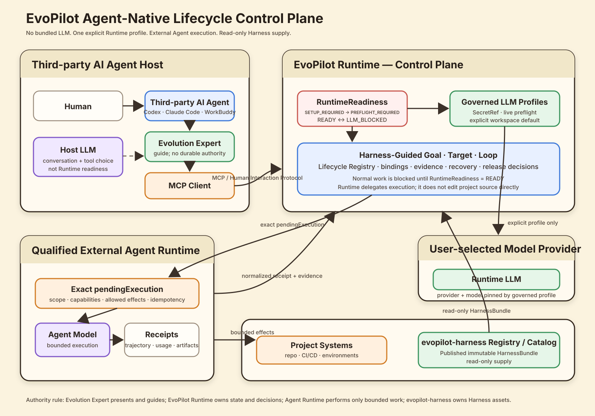

# EvoPilot

> Evidence-driven self-evolution control plane for AI-agent products, with governed goals, auditable loops, human approval, release decisions, and installable distribution paths.

[](https://nodejs.org/)
[](https://www.typescriptlang.org/)
[](#self-hosting-and-distribution)
[](#release-status)
[](LICENSE)

[Quick Start](#quick-start) | [Distribution](docs/operations/distribution.md) | [CLI](docs/cli/README.md) | [Self-Hosting](docs/operations/self-hosting.md) | [API](docs/api/README.md) | [Docs](docs/README.md) | [Changelog](CHANGELOG.md) | [Security](SECURITY.md)

EvoPilot helps teams operate AI-agent products as releasable software. It collects evidence from runtime events, traces, evaluations, CI/CD, source changes, LLM calls, and user feedback; turns that evidence into reviewable evolution opportunities; then governs goal planning, loop execution, source closure, delivery, and product-native `GO` / `NO-GO` release decisions.

It is not an agent runtime, prompt playground, generic code generator, or Harness Asset lifecycle manager. Harness definitions are authored, evolved, reviewed, versioned, and published by the independent `evopilot-harness` project. EvoPilot reads a configured Harness Registry and the published Catalog directories it points to, then uses an open product-delivery Lifecycle Harness to execute project goals against the selected immutable HarnessBundle.

## v6.2 First-Run LLM Readiness

EvoPilot Runtime **v6.2.0** and Evolution Expert **v2.2.0** have immutable published artifacts. Expert 2.2.0 requires public CLI completion recovery; this source tree implements independently approved **Expert v2.2.1**, which is not yet accepted or released. Runtime 6.2.0 bytes remain unchanged. The product core remains `Goal -> Loop -> Target`, guided by an exact published Harness and one active, immutable Lifecycle revision:

```text
Project Definition + GoalTarget -> published HarnessProfile -> immutable HarnessBundle
                                      + open Lifecycle -> governed Goal Target Loop
```

Runtime owns a tenant/workspace Lifecycle Registry with immutable YAML revisions, active pointers, semantic diff, dependencies, usage, audit, archive/restore, and rollback. DataRig, EvoPilot, evopilot-harness, and future projects are declarations—not privileged Engine profiles. Compatible project and Pipeline revisions can evolve without a Runtime or Expert release.

Runtime 6.2 adds a mandatory first-run LLM readiness gate. EvoPilot ships with **no provider, model, API key, inherited Host LLM, or hidden environment fallback**. A production Runtime starts safely in `SETUP_REQUIRED`, exposes only health and setup surfaces, and unlocks normal project, Harness, Goal, Target, and Loop work only after an administrator selects a provider and model, stores the credential through Host-native secure input as a `SecretRef`, completes a live preflight, and explicitly binds that exact Profile digest as the workspace default. Evolution Expert 2.2 guides this flow over MCP without ever requesting or receiving the raw credential. See [First-Run LLM Readiness](docs/guides/first-run-llm-readiness.md).

Evolution Expert is the ordinary-human entry and talks to Runtime only through MCP. It is independently installed into Codex, Claude Code, designated-human WorkBuddy, generic Agent, or generic MCP Hosts. Runtime never embeds a general-purpose coding Agent: it emits an exact `pendingExecution` to a qualified external Agent Runtime, validates the normalized receipt, and resumes from durable state.

The published v6.1 completion baseline remains immutable. Runtime 6.2 and Expert 2.2 must add first-install, headless, upgrade, degradation, repair, raw-secret refusal, cross-Host, architecture-documentation, and `NO_REGRESSION` evidence on an exact installed Candidate pair before either release can be authorized.

EvoPilot Codex Suite 3.2.1 remains historical reference evidence. The exact active DataRig Codex Suite 2.1.11 snapshot is used read-only to prove production-reference convergence into independently versioned `datarig-production-delivery@1.0.0` declarations. Neither Suite is a Runtime dependency, execution path, synchronization source, or fallback. Existing installed Suites remain untouched; any real switch or retirement stays behind a separately approved post-release [Cutover](docs/guides/legacy-suite-transition.md).

## Start Here

| Entry | Use when | Command |
| --- | --- | --- |
| Install CLI | You already have an EvoPilot server and want the verified public package | `npm install -g @evopilot/cli@6.1.0` |
| Self-host now | You want the API, worker, code-upgrader, Postgres, and Dashboard together | `bash -c "$(curl -fsSL https://raw.githubusercontent.com/yeliang-wang/evopilot/v6.1.0/install.sh)"` |
| Kubernetes | You run EvoPilot on a cluster | `helm install evopilot ./charts/evopilot --namespace evopilot --create-namespace` |

Desktop installer and hosted Cloud trial are not published EvoPilot surfaces yet. The supported public entry points are the six exact-version npm packages, GitHub Release tarballs, the self-host installer, Helm, and GHCR images.

## What You Can Do

| Area | What EvoPilot provides |
| --- | --- |
| Govern product evolution | Tenant/workspace Lifecycle Registry CRUD over immutable human-readable YAML, risk-based authority gates, automatic deterministic stages, evidence closure, and final release decisions. |
| Run auditable loops | Durable loop state, executor graphs, checkpoints, replay, worker leases, watchdog recovery, and timeline audit. |
| Onboard any project declaratively | Discovery, immutable human-readable Project Definitions and resources, schema-driven questions, semantic impact, versioned activation/rollback, and no project-specific Runtime branches. |
| Converge Suite capabilities | Exact source provenance, 100% capability disposition, project-neutral governed resources, typed Action Providers, and zero hidden Suite fallback. |
| Evolve project Pipelines safely | Exact observations, deterministic gap classification, immutable successors, comparable experiments, policy-preauthorized safe activation, monitoring, and idempotent rollback without project-specific Core branches. |
| Recover and learn safely | Bounded automatic repair/retry/resume plus an Automation Registry where one reviewed proposal can automate future equivalent safe failures. |
| Repair across Candidates safely | Durable remediation campaigns preserve source/Candidate lineage, receipts, budgets, failed-first reruns, impact closure, full-matrix reruns, and exact human stop boundaries. |
| Consume published Harnesses | Dynamically reads configured `evopilot-harness` Registry/Catalog roots, matches published v3 Profiles, binds immutable Bundles, and stores the complete Profile/Component/Bundle digest closure in goal plans. |
| Control source and delivery | Bounded code-upgrader execution, allowed paths, validation commands, source closure, CI/CD delivery, and deploy evidence. |
| Track LLM usage by project | Server-projected provider/model/profile rows, token totals, latest loop tokens, and request IDs for connected projects and workspaces. |
| Operate through Agents | Evolution Expert over MCP is the ordinary-human surface; HTTP, CLI, CI, events, webhooks, and Dashboard remain administrator, machine, diagnostics, and recovery surfaces. |
| Distribute and verify releases | Release package tarballs, self-host installer, Helm chart, source archive, SPDX SBOM, provenance, checksums, and GHCR image digest metadata. |

## Quick Start

For local development:

```bash
npm install
npm run build
EVOPILOT_HARNESS_REGISTRY_CONFIG=/path/to/evopilot-harness/harness-registry.yaml npm run server:debug
curl http://127.0.0.1:19876/health
curl http://127.0.0.1:19876/ready
```

`server:debug` is a developer-only compatibility mode. A production installation deliberately begins in `SETUP_REQUIRED`; open Evolution Expert in the Agent Host and say “检查 EvoPilot LLM readiness，并引导我安全完成首次配置。” The Expert discovers provider choices, invokes Host-native secure credential input, creates and preflights a governed Profile, binds it explicitly to the workspace, and confirms `READY`. It never treats the Host's own conversational model as EvoPilot's Runtime LLM.

Run the standalone Dashboard from the
[`yeliang-wang/evopilot-dashboard`](https://github.com/yeliang-wang/evopilot-dashboard)
sibling repository:

```bash
cd ../evopilot-dashboard
EVOPILOT_API_BASE_URL=http://127.0.0.1:19876 npm run dev
```

To supply Harness definitions, publish them in `evopilot-harness` and point EvoPilot at the published directory:

```bash
cd ../evopilot-harness
evopilot-harness evolve --source-project /path/to/source-project --goal "Create or evolve the domain harness." --approve-and-publish --confirmed-by platform-admin --confirmation "Reviewed source coverage and generated pack." --json
evopilot-harness registry publish --catalog published --registry harness-registry.yaml --json
evopilot-harness registry validate --registry harness-registry.yaml --json

cd ../evopilot
EVOPILOT_HARNESS_REGISTRY_CONFIG=../evopilot-harness/harness-registry.yaml npm run server:debug
```

EvoPilot reads `harness-registry.yaml`, then each enabled Catalog's `CATALOG.md`, at use time. It does not import, mount, approve, publish, or evolve Harness definitions.

## Administrator And Machine CLI

The CLI is an HTTP client for remote EvoPilot API servers. In v6 it is for administrators, machines, diagnostics, and recovery—not the direct ordinary-human path. Ordinary users install the [Evolution Expert Host Integration Bundle](docs/guides/evolution-expert.md) in their Agent Host and converse through MCP.

```bash
export EVOPILOT_SERVER="https://evopilot.example.com"
export EVOPILOT_API_TOKEN="<operator-or-admin-token>"
export EVOPILOT_TENANT="tenant-production"
export EVOPILOT_WORKSPACE="workspace-agent-products"

evopilot status --json
evopilot target plan --project <project-id> --objective "<business objective>" --llm-profile <llm-profile-id> --json
evopilot target plan approve <goal-id> --confirmed-by "<project-owner>" --confirmation "<phase plan reviewed and approved>" --json
evopilot target run --project <project-id> --objective "<business objective>" --llm-profile <llm-profile-id> --json
```

`evopilot harness ...` authoring and publication commands are intentionally absent from EvoPilot Runtime. Use `evopilot-harness` for the independent Harness asset lifecycle; EvoPilot only discovers, matches, binds, and consumes published assets.

Start with [AGENTS.md](AGENTS.md), then use [docs/cli/AGENTS.md](docs/cli/AGENTS.md), [CLI Quickstart](docs/cli/quickstart.md), [CLI Automation](docs/cli/automation.md), and the [AI Agent Runbook](docs/guides/ai-agent-runbook.md).

## Self-Hosting And Distribution

For production, use the documented install and release paths rather than ad hoc local builds:

- [Distribution](docs/operations/distribution.md)
- [Self-Hosting](docs/operations/self-hosting.md)
- [Deployment](docs/operations/deployment.md)
- [Release Management](docs/operations/release-management.md)
- [Troubleshooting](docs/operations/troubleshooting.md)

Immutable ECS deployment uses the image reference recorded in the GitHub Release image metadata:

```bash
export EVOPILOT_IMAGE='ghcr.io/yeliang-wang/evopilot@sha256:<digest>'
docker compose -p evopilot --env-file .env.production -f deploy/ecs/compose.immutable.yaml up -d --no-build
```

For production Harness consumption, mount the Registry file and published Catalog directory into the container and set:

```bash
EVOPILOT_HARNESS_REGISTRY_CONFIG=/opt/evopilot-harness/harness-registry.yaml
```

## Release Status

Runtime **v6.2.0** and Expert **v2.2.0** are published immutable history. Their completed Candidate evidence does not prove the defective public Expert CLI. The separately approved **Expert v2.2.1 public CLI recovery** is under implementation; its Candidate acceptance and Release remain pending. No Host installation, Secret operation, Suite change or Cutover is implied by this source tree.

The unpublished v3.2 Bundle-consumer closure is inherited by v4.0 without a standalone v3.2 release. v4.0 keeps EvoPilot's strict read-only Harness-asset boundary while adding open YAML Lifecycle execution for project goals.

Release evidence:

- Published Runtime 6.2.0 evidence: [docs/releases/6.2.0.md](docs/releases/6.2.0.md)
- Published Expert 2.2.0 history: [docs/releases/evolution-expert-2.2.0.md](docs/releases/evolution-expert-2.2.0.md)
- Expert 2.2.1 recovery (not released): [docs/releases/evolution-expert-2.2.1.md](docs/releases/evolution-expert-2.2.1.md)
- Previous release notes: [docs/releases/4.0.0.md](docs/releases/4.0.0.md)
- Release package evidence: [docs/reference/release-package.md](docs/reference/release-package.md)
- Production user E2E evidence: [docs/reference/production-user-e2e.md](docs/reference/production-user-e2e.md)
- Open-source readiness: [docs/reference/open-source-readiness.md](docs/reference/open-source-readiness.md)
- Open-source maturity report: [docs/reference/open-source-maturity-report.md](docs/reference/open-source-maturity-report.md)

The authoritative product verdict is exposed by:

```http
GET /api/v1/release/decisions
```

## Architecture

EvoPilot is an Agent-native lifecycle control plane, not the third-party Agent Runtime that edits source. A human converses with Codex, Claude Code, WorkBuddy, or another qualified Host using that Host's **Host LLM**. Evolution Expert translates the conversation into typed MCP operations. EvoPilot Runtime owns durable governance state and uses a separately configured **Runtime LLM** only through an explicit workspace Profile. When bounded source work is required, Runtime emits an exact `pendingExecution` to a qualified external Agent Runtime; that runtime may use its own **Agent Model** and must return normalized receipts. These three model identities are independent and never substitute for one another.



[PNG fallback](docs/assets/architecture/evopilot-agent-native-architecture.png) · [First-Run LLM Readiness](docs/guides/first-run-llm-readiness.md)

The Runtime reads immutable HarnessBundles from `evopilot-harness` Registry/Catalog roots and composes them with the active human-readable Lifecycle. Evolution Expert guides; Runtime decides and records; the external Agent Runtime performs only explicitly bounded effects; `evopilot-harness` remains the independent Harness producer.

Key architecture docs:

- [Continuous Evolution Control Plane](docs/architecture/continuous-evolution-control-plane.md)
- [Agent-Native Lifecycle Control Plane](docs/architecture/agent-native-lifecycle-control-plane.md)
- [First-Run LLM Readiness](docs/guides/first-run-llm-readiness.md)
- [Loop Runtime Architecture](docs/architecture/loop-runtime.md)
- [ProofOps Target Loop Mode](docs/architecture/proofops-target-loop-mode.md)
- [Dashboard Integration](docs/guides/dashboard-integration.md)

## API

Primary API surfaces include health/readiness, auth and users, projects and evidence, DevOps preflight, read-only Harness Catalog projection, LLM profiles, global goals, loops, source closure, release decisions, and SaaS administration.

See [API Reference](docs/api/README.md) and [OpenAPI](docs/api/openapi.json).

## Development

```bash
npm run build
npm run check
npm run cli:test
npm run verify:distribution
npm run release:artifact
npm run verify:release-artifact
git diff --check
```

Repository map:

| Path | Purpose |
| --- | --- |
| `packages/contracts/` | Shared API, CLI, runtime, version, and package-boundary contracts. |
| `packages/client/` | HTTP client used by CLI and external integrations. |
| `packages/cli/` | Agent-safe HTTP adapter CLI. |
| `packages/create-evopilot/` | Self-host package used by the release installer to generate a complete Compose stack. |
| `packages/server/` | HTTP control-plane runtime, thin compatibility adapter, RBAC, tenant/workspace scope, audit, and server-side modules. |
| `packages/worker-runtime/` | Loop worker runtime package used by `scripts/loop-worker.mjs`. |
| `packages/evolution-expert/` | Independently versioned ordinary-human conversational Core and generated Host adapters. |
| `packages/adapter-*` | Source, DevOps, MCP, and code-upgrader connector adapters. |
| `charts/evopilot/` | Helm chart for API, worker, code-upgrader, Postgres, Dashboard, and Ingress. |
| `deploy/` | Docker Compose, ECS, and Kubernetes deployment assets. |
| `docs/` | User, API, deployment, architecture, testing, distribution, and release docs. |

Architecture boundaries are documented in [Package Boundaries](docs/architecture/package-boundaries.md) and verified with `npm run verify:architecture`.

## Documentation

| Reader | Start here |
| --- | --- |
| New user | [Quick Start](docs/quickstart.md), [Distribution](docs/operations/distribution.md) |
| AI agent or CLI automation | [CLI](docs/cli/README.md), [CLI Automation](docs/cli/automation.md), [AI Agent Runbook](docs/guides/ai-agent-runbook.md) |
| API integrator | [API Reference](docs/api/README.md), [OpenAPI](docs/api/openapi.json) |
| Production operator | [Self-Hosting](docs/operations/self-hosting.md), [Deployment](docs/operations/deployment.md) |
| Release maintainer | [Release Management](docs/operations/release-management.md), [Open Source Maturity Report](docs/reference/open-source-maturity-report.md) |
| Architect | [Architecture](docs/architecture/README.md) |

## Governance

Public trust and governance assets:

- [CONTRIBUTING.md](CONTRIBUTING.md)
- [CODE_OF_CONDUCT.md](CODE_OF_CONDUCT.md)
- [SECURITY.md](SECURITY.md)
- [NOTICE](NOTICE)
- [LICENSE](LICENSE)
- [CHANGELOG.md](CHANGELOG.md)
- [Open Source Readiness](docs/reference/open-source-readiness.md)
- [Open Source Maturity Report](docs/reference/open-source-maturity-report.md)
- [GitHub Metadata](docs/reference/github-metadata.md)
