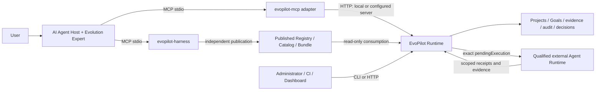

# Architecture

> EvoPilot is an Agent-native control plane for governed product evolution. Evolution Expert guides the conversation; Runtime owns durable state and decisions.

## Product Split

The installed Host-facing servers use stdio. The EvoPilot MCP adapter bridges
that transport to the separate Runtime HTTP service; a local Runtime commonly
listens at `http://127.0.0.1:19876`. Expert is a generated guidance adapter loaded
by the Host, not a separate server process. Harness has its own MCP server and
asset lifecycle. It does not own project execution or Runtime release decisions.

The Host LLM, Runtime LLM Profile, and external executor's Agent Model are
independently configured. Connecting the Host does not import its model or
credentials into Runtime. Project resources, execution providers and independent
evidence collectors must be configured for the actual project; they are not
created by tool discovery. See [installation](../guides/agent-host-installation.md)
and [external execution](../guides/agent-runtime.md).

EvoPilot owns the domain model and execution state. The Dashboard is a replaceable UI client that consumes the API.

## Package Boundaries

The current TypeScript workspace is split by control-plane responsibility:

| Package | Responsibility |
|---|---|
| `@evopilot/contracts` | Shared schema names, version constants, and API/CLI/runtime boundary metadata. |
| `@evopilot/core` | Evidence, evolution, delivery, and release domain primitives. |
| `@evopilot/server` | HTTP control-plane runtime, thin compatibility adapter, runtime auth/config helpers, executor adapters, RBAC, audit, tenant/workspace scope, and API orchestration. |
| `@evopilot/worker-runtime` | Loop worker polling, heartbeat, watchdog, and start/resume API loop. |
| `@evopilot/cli` | HTTP adapter CLI for agent-safe JSON and operator output. |
| `@evopilot/client` | HTTP request helper for CLI and integrations. |
| `@evopilot/adapter-mcp` | Host-facing stdio tools forwarding typed requests to Runtime HTTP; no independent authority. |
| `@evopilot/evolution-expert` | Independently versioned conversational Core and generated Host guidance adapters. |

`@evopilot/harness` lives in its own repository and owns asset authoring,
review, versioning and publication. A **HarnessBundle** is a published immutable
asset closure; a Runtime **Lifecycle** orchestrates a project around that closure.
The **Evolution Expert** guides project work, while Harness's **Digital Expert**
guides Harness asset production. These are distinct responsibilities.

See [Package Boundaries](package-boundaries.md) for ownership rules, transitional hotspots, and validation commands.

## Bounded Contexts

| Context | Responsibility |
|---|---|
| Project | Registered products, source credentials, workspace ownership |
| Harness Catalog Consumer | Read-only published Harness Catalog loading, automatic selected-Harness matching, and goal-plan digest evidence |
| Lifecycle Registry | Tenant/workspace immutable YAML revisions, active pointers, diff, dependencies, usage, audit, archive/restore, and rollback over a closed Action Registry |
| Governed Evolution Runtime | Declarative Project definitions, deterministic Harness matching, monotonic Harness/Lifecycle composition, exact Loop binding, durable state, and Automation Registry recovery |
| Evolution Expert | Independently versioned ordinary-human guidance over MCP; no canonical state, Harness authority, or source execution |
| External Agent Runtime | Qualified bounded source execution for an exact `pendingExecution`; normalized receipts, effects, artifacts, usage, and evidence only |
| Evidence | Runtime signals, trace/log/eval ingestion, evidence bundles |
| GlobalGoal | Goal decomposition into GoalTargets, progress, graph, timeline, final report |
| Loop Runtime | LoopRun execution, worker leases, sandbox proof, trace, events, replay |
| Source Closure | Writeback, review decision, merge/promotion gates |
| Release Governance | ReleaseTarget profiles and authoritative release decisions |
| CLI Adapter | Atomic commands and wrapper commands over the API |
| Dashboard Adapter | Visual workflow and operations UI over the API |

## Key Rule

The Dashboard can visualize and request actions, but only EvoPilot API state can decide what happened. Release conclusions come from release decisions, not UI inference.

Deep architecture notes remain in:

- [Continuous Evolution Control Plane](continuous-evolution-control-plane.md)
- [Package Boundaries](package-boundaries.md)
- [ADR: EvoPilot / evopilot-harness Boundary](adr/0001-evopilot-harness-boundary.md)
- [ADR: Open Lifecycle Harness](adr/0002-open-lifecycle-harness.md)
- [ADR: Harness-Guided Governed Evolution Runtime](adr/0003-harness-guided-governed-evolution-runtime.md)
- [ADR: Executable v5 Completion Recovery](adr/0004-v5-completion-recovery.md)
- [Harness-Guided Governed Evolution Runtime](harness-guided-governed-evolution-runtime.md)
- [Agent-Native Lifecycle Control Plane](agent-native-lifecycle-control-plane.md)
- [Open Lifecycle Harness](open-lifecycle-harness.md)
- [Published Harness Catalog](published-harness-catalog.md)
- [Semantic Catalog Reader — Runtime 6.3.0 Reference](semantic-catalog-consumer.md) — released discovery, project/execution binding, evidence, completion and transport boundaries.
- [Harness Template Boundary](harness-template-domain.md)
- [Loop Runtime](loop-runtime.md)
- [ProofOps Target Loop Mode](proofops-target-loop-mode.md)
