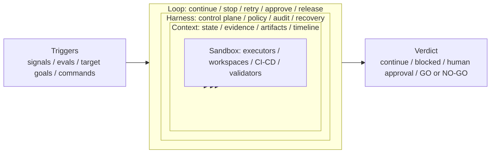

# Continuous Evolution Control Plane

## Status

Accepted

## Purpose

EvoPilot is a continuous evolution control plane for AI Agent products. It does not try to replace agent runtimes, CI/CD systems, observability platforms, or code editors. It connects them into a governed product loop: executors work inside bounded environments, durable context survives across rounds, governance decides what may continue, and release decisions state whether the product can move forward.

This model is based on the Loop Engineering idea shown as nested layers: `Sandbox -> Context -> Harness -> Loop`. EvoPilot keeps that design intent, but maps it to product evolution capabilities instead of copying the diagram as decoration.

## Loop Engineering Mapping

| Layer | Design question | EvoPilot ownership |
|---|---|---|
| Sandbox | How are executors isolated, constrained, and validated before they can affect product state? | per-step workspaces, code-upgrader runtime, protected path checks, validation commands, Jenkins/GitLab delivery boundaries |
| Context | How does a 24h+ task keep progress, evidence, artifacts, and intermediate results across rounds? | `LoopRun`, `LoopIteration`, timeline, evidence sets, artifacts, project profile, evaluation datasets, release evidence |
| Harness | What control plane applies policy, approval, audit, observability, and recovery? | `/api/v1/loops`, RBAC, approval APIs, audit log, structured logs, watchdog, heartbeat leases, retry/stop policies |
| Loop | When should the system continue, stop, retry, escalate, split work, or produce a release decision? | trigger rules, resume/cancel/approve APIs, ProofOps target loops, release targets, final `GO` / `CONDITIONAL-GO` / `NO-GO` |

## Core Design Questions

The model exists to answer concrete product questions:

| Question | EvoPilot answer |
|---|---|
| How is the next round triggered? | runtime evidence, evaluation results, user feedback, schedules, IM/Codex commands, release targets, or target-loop goals |
| How is each round independently verified? | `LoopEvidenceSet`, validators, CI/CD artifacts, release evidence, and product-native decision criteria |
| When does work stop or route to a human? | approval gates, stop policy, repeated-failure blocking, timeout watchdog, release-action approval |
| How are cross-round state and intermediate results retained? | durable loop state, timeline events, artifacts, evidence bundles, project profiles, audit records |
| How can multiple executors cooperate without hiding risk? | executor graphs, bounded workspaces, code-upgrader evidence, CI/CD boundaries, approval checkpoints |
| How does 24h+ work remain operable? | heartbeat leases, watchdog recovery, structured JSON logs, retry policy, timeline and artifact inspection |

## Product Control Model



## Runtime Mapping

The product loop maps to current EvoPilot runtime surfaces:

| Product concern | Current implementation |
|---|---|
| Evidence collection | `POST /api/v1/evidence/events`, OTLP trace/log endpoints, SkyWalking, evaluations, feedback |
| Opportunity and risk decisions | evidence clustering, dynamic baselines, scorecards, governance policy evaluations, release readiness |
| Plan review | Markdown opportunity drafts and user-edited evolution plans |
| Long-running execution | `LoopRun`, executor graphs, loop worker, heartbeat leases, watchdog recovery |
| Code and delivery actions | code-upgrader runtime, branch/commit evidence, Jenkins/GitLab connector boundaries |
| Release governance | release targets, release evidence bundles, scenario matrices, release decisions |
| Human control | RBAC roles, approval gates, release-action approval, audit records |
| Operability | structured JSON Lines logs, request ids, production deployment checks |

## Boundaries

EvoPilot owns the control plane. Agent runtimes, LLM providers, code-upgrader workers, Jenkins/GitLab, observability systems, and IM adapters remain external executors or evidence sources.

EvoPilot should not:

- execute product-changing work without project registration, policy allowance, and required approval.
- treat a healthy process or one successful CI run as a product-native release decision.
- replace a concrete executor with a simulated success path in production mode.
- hide long-task failures behind a generic agent-loop abstraction.

EvoPilot should:

- keep every product-changing step tied to evidence, artifacts, audit, and release criteria.
- let high-risk actions continue through explicit approval gates.
- preserve enough timeline and structured logs for recovery and production debugging.
- make `GET /api/v1/release/decisions` the product-native release verdict.
- require mainstream Loop Harness alignment evidence before GA stable release. The GA target must explicitly compare EvoPilot with current GitHub-popular adjacent projects such as LangGraph, CrewAI, AutoGen, OpenAI Agents SDK, E2B, Temporal, and DBOS across durable execution, checkpoint/persistence, human-in-loop, sandbox, multi-executor coordination, streaming trace, guardrails, and source-to-production closure.

## Relationship To Loop Runtime

Loop Runtime implements the continuity and execution substrate of this model. It keeps long-running work alive, coordinates executors, records iterations, and produces independent evidence sets.

The broader product control plane also includes project registration, evidence ingestion, opportunity discovery, review, release governance, and product-native decisions. That distinction matters because EvoPilot is not only a loop scheduler. Its value is deciding whether a real AI Agent product should evolve, continue, stop, route to a human, or release.

## Self-Hosted Improvement Boundary

EvoPilot supports a self-hosted improvement entrypoint through `scripts/evopilot-self-loop.mjs`. The entrypoint treats EvoPilot as a normal target project under the same control plane APIs used for other projects:

```text
local checkout -> /api/v1/projects -> /api/v1/evidence/events -> /api/v1/loops
```

For production control planes, the first step should usually be a remote repository target:

```text
GitHub or GitLab repository -> /api/v1/projects -> /api/v1/evidence/events -> /api/v1/loops
```

The controller and target are intentionally separated even when they point at the same repository. The control plane persists project registration, evidence, loop context, stop policy, retry policy, timeline, and approval state. The target scope is constrained in loop context with allowed paths and validation commands.

Repository validation runs inside the EvoPilot server process. A production server cannot validate a Mac-local `/Users/.../EvoPilot` path unless that checkout also exists on the server. Use `github` or `gitlab` target registration when the control plane is remote from the developer workstation.

This is not uncontrolled self-modification. The default command creates the target project, evidence, and loop only. Starting a runtime iteration requires `EVOPILOT_SELF_LOOP_START=1`, and production-changing work still requires an approved executor contract, independent validation, and human approval gates.

## Validation

Use the product validation gates that match the behavior being changed:

```bash
npm run loop-runtime:check
npm run proofops-mode:check
npm run check
git diff --check
```

`npm run check` verifies build, tests, production asset checks, and high-risk dependency audit. It is still not by itself a GA verdict; final release status is determined by product-native release evidence and `GET /api/v1/release/decisions`.
