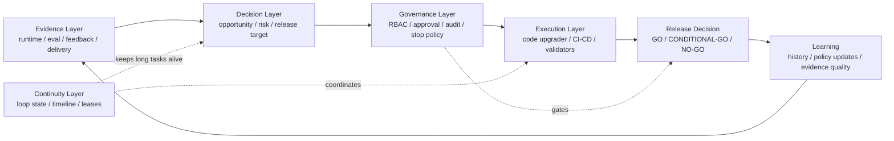

# Continuous Evolution Control Plane

## Status

Accepted

## Purpose

EvoPilot is a continuous evolution control plane for AI Agent products. It does not try to replace agent runtimes, CI/CD systems, observability platforms, or code editors. It connects them into a governed product loop: evidence creates context, decisions define what should change, approvals protect product boundaries, executors perform the work, validation produces release evidence, and release decisions state whether the product can move forward.

This model takes the long-task agent engineering idea and expresses it through EvoPilot's actual product capabilities instead of copying a generic `Sandbox / Context / Harness / Loop` diagram.

## Product Layers

| Layer | Responsibility | EvoPilot ownership |
|---|---|---|
| Evidence Layer | Ingest and normalize runtime, evaluation, delivery, cost, security, and user feedback signals. | `/api/v1/evidence/*`, OTLP, SkyWalking, evaluations, feedback, evidence bundles, runtime metrics |
| Decision Layer | Turn evidence into opportunities, risk judgments, approval requirements, and release conclusions. | evidence clustering, failure attribution, scorecards, SLO/cost/supply-chain rules, release targets, `GO` / `NO-GO` |
| Execution Layer | Turn approved plans into concrete implementation and delivery actions. | code-upgrader runtime, Loop Runtime executor graphs, Jenkins/GitLab delivery, validators, artifacts |
| Governance Layer | Enforce permissions, review gates, auditability, stop conditions, and operational recovery. | RBAC, approval APIs, audit log, structured production logs, watchdog, retry/stop policy, release action approval |
| Continuity Layer | Keep long-running work consistent across rounds, workers, tools, failures, and time windows. | `LoopRun`, `LoopIteration`, timeline, evidence sets, artifacts, heartbeat leases, worker recovery |

## Control Plane Loop



## Runtime Mapping

The product loop maps to current EvoPilot runtime surfaces:

| Product concern | Current implementation |
|---|---|
| Evidence collection | `POST /api/v1/evidence/events`, OTLP trace/log endpoints, SkyWalking, evaluations, feedback |
| Opportunity and risk decisions | evidence clustering, dynamic baselines, scorecards, governance policy evaluations, release readiness |
| Plan review | Markdown opportunity drafts and user-edited evolution plans |
| Long-running execution | `LoopRun`, executor graphs, loop worker, heartbeat leases, watchdog recovery |
| Code and delivery actions | code-upgrader runtime, branch/commit evidence, Jenkins/GitLab connector boundaries |
| Release governance | release targets, release evidence bundles, scenario matrices, release decisions |
| Human control | RBAC roles, approval gates, release-action approval, audit records |
| Operability | structured JSON Lines logs, request ids, production deployment checks |

## Boundaries

EvoPilot owns the control plane. Agent runtimes, LLM providers, code-upgrader workers, Jenkins/GitLab, observability systems, and IM adapters remain external executors or evidence sources.

EvoPilot should not:

- execute product-changing work without project registration, policy allowance, and required approval.
- treat a healthy process or one successful CI run as a product-native release decision.
- replace a concrete executor with a simulated success path in production mode.
- hide long-task failures behind a generic agent-loop abstraction.

EvoPilot should:

- keep every product-changing step tied to evidence, artifacts, audit, and release criteria.
- let high-risk actions continue through explicit approval gates.
- preserve enough timeline and structured logs for recovery and production debugging.
- make `GET /api/v1/release/decisions` the product-native release verdict.

## Relationship To Loop Runtime

Loop Runtime implements the continuity and execution substrate of this model. It keeps long-running work alive, coordinates executors, records iterations, and produces independent evidence sets.

The broader product control plane also includes Evidence, Decision, Governance, and Release layers. That distinction matters because EvoPilot is not only a loop scheduler. Its value is deciding whether a real AI Agent product should evolve, continue, stop, or release.

## Validation

Use the product validation gates that match the behavior being changed:

```bash
npm run loop-runtime:check
npm run proofops-mode:check
npm run check
git diff --check
```

`npm run check` verifies build, tests, production asset checks, and high-risk dependency audit. It is still not by itself a GA verdict; final release status is determined by product-native release evidence and `GET /api/v1/release/decisions`.
