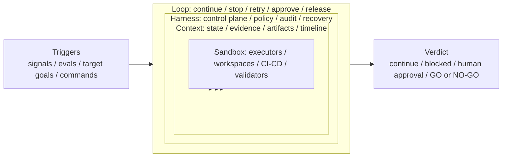
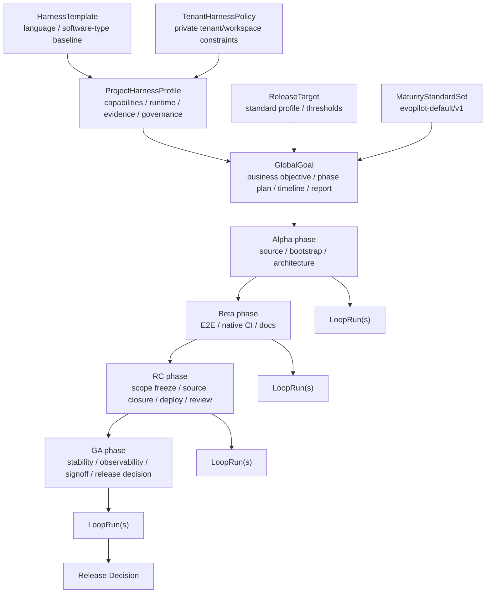

# Continuous Evolution Control Plane

## Status

Accepted

## Purpose

EvoPilot is a continuous evolution control plane for AI Agent products. It does not try to replace agent runtimes, CI/CD systems, observability platforms, or code editors. It connects them into a governed product loop: executors work inside bounded environments, durable context survives across rounds, governance decides what may continue, and release decisions state whether the product can move forward.

This model is based on the Loop Engineering idea shown as nested layers: `Sandbox -> Context -> Harness -> Loop`. EvoPilot keeps that design intent, but maps it to product evolution capabilities instead of copying the diagram as decoration.

## Loop Engineering Mapping

| Layer | Design question | EvoPilot ownership |
|---|---|---|
| Sandbox | How are executors isolated, constrained, and validated before they can affect product state? | per-step workspaces, code-upgrader runtime, protected path checks, validation commands, GitHub Actions/GitLab CI delivery boundaries |
| Context | How does a 24h+ task keep progress, evidence, artifacts, and intermediate results across rounds? | `LoopRun`, `LoopIteration`, timeline, evidence sets, artifacts, project profile, evaluation datasets, release evidence |
| Harness | What control plane applies policy, approval, audit, observability, and recovery? | `/api/v1/loops`, RBAC, approval APIs, audit log, structured logs, watchdog, heartbeat leases, retry/stop policies |
| Loop | When should the system continue, stop, retry, escalate, split work, or produce a release decision? | trigger rules, resume/cancel/approve APIs, ProofOps target loops, release targets, final `GO` / `CONDITIONAL-GO` / `NO-GO` |

## Core Design Questions

The model exists to answer concrete product questions:

| Question | EvoPilot answer |
|---|---|
| How is the next round triggered? | runtime evidence, evaluation results, user feedback, schedules, IM/Codex commands, release targets, or target-loop goals |
| How is each round independently verified? | `LoopEvidenceSet`, validators, CI/CD artifacts, release evidence, and product-native decision criteria |
| When does work stop or route to a human? | approval gates, stop policy, repeated-failure blocking, timeout watchdog, release-action approval |
| How are cross-round state and intermediate results retained? | durable loop state, timeline events, artifacts, evidence bundles, project profiles, audit records |
| How can multiple executors cooperate without hiding risk? | executor graphs, bounded workspaces, code-upgrader evidence, CI/CD boundaries, approval checkpoints |
| How does 24h+ work remain operable? | heartbeat leases, watchdog recovery, structured JSON logs, retry policy, timeline and artifact inspection |

## Product Control Model


```mermaid
flowchart LR
  subgraph Loop["Loop: continue / stop / retry / approve / release"]
    subgraph Harness["Harness: control plane / policy / audit / recovery"]
      subgraph Context["Context: state / evidence / artifacts / timeline"]
        Sandbox["Sandbox: executors / workspaces / CI-CD / validators"]
      end
    end
  end

  Trigger["Triggers\nsignals / evals / target goals / commands"] --> Loop
  Loop --> Verdict["Verdict\ncontinue / blocked / human approval / GO or NO-GO"]
  Sandbox --> Context --> Harness --> Loop
```

## GlobalGoal Layer

GlobalGoal adds one product layer above LoopRun for business objectives that should not be treated as a single execution run. The user writes the desired product outcome; EvoPilot owns the maturity decomposition.


```mermaid
flowchart TD
  HarnessTemplate["HarnessTemplate\nlanguage / software-type baseline"] --> HarnessProfile["ProjectHarnessProfile\ncapabilities / runtime / evidence / governance"]
  TenantPolicy["TenantHarnessPolicy\nprivate tenant/workspace constraints"] --> HarnessProfile
  HarnessProfile --> GlobalGoal
  ReleaseTarget["ReleaseTarget\nstandard profile / thresholds"] --> GlobalGoal["GlobalGoal\nbusiness objective / phase plan / timeline / report"]
  Standards["MaturityStandardSet\nevopilot-default/v1"] --> GlobalGoal
  GlobalGoal --> Alpha["Alpha phase\nsource / bootstrap / architecture"]
  Alpha --> Beta["Beta phase\nE2E / native CI / docs"]
  Beta --> RC["RC phase\nscope freeze / source closure / deploy / review"]
  RC --> GA["GA phase\nstability / observability / signoff / release decision"]
  Alpha --> LoopRunA["LoopRun(s)"]
  Beta --> LoopRunB["LoopRun(s)"]
  RC --> LoopRunC["LoopRun(s)"]
  GA --> LoopRunD["LoopRun(s)"]
  LoopRunD --> Decision["Release Decision"]
```

From a DDD perspective:

| Concept | Bounded-context responsibility |
|---|---|
| `GlobalGoal` aggregate | Owns the user's business objective, generated Alpha/Beta/RC/GA plan, ordered GoalTargets, timeline, progress, blockers, evidence matrix, phase packages, and final report. It answers "where are we in this goal ladder?" |
| `GoalTarget` entity | Represents one observable sub-target with phase, dependencies, acceptance criteria, required evidence, review capabilities, status, next action, evidence, blocker, and optional `loopId`. |
| `PhaseTarget` entity | Represents one maturity phase with baseline standards, project-specific additions, package outputs, and GO/NO-GO decision. |
| `LoopRun` aggregate | Remains the execution substrate. It owns executor graph progress, iterations, sandbox proof, worker lease, approvals, source closure, artifacts, trace, and loop evidence. |
| `ProjectHarnessProfile` aggregate | Owns the project-level harness definition: capability boundaries, runtime commands, validation, evidence, failure handling, diagnostics, observability, governance, phase mapping, LLM draft policy, template refs, policy refs, version, and digest. It is stored under tenant/workspace/project scope and is activated explicitly. |
| `HarnessTemplate` profile | Public platform or administrator-published language/software-type baseline inherited by project profiles. EvoPilot automatically matches one published template during project profile generation unless an administrator explicitly overrides it. Administrators maintain human-readable packs under `harness-templates/public/<template-id>/` and publish them through `evopilot harness template pack validate|publish`; direct YAML/JSON `harness template upgrade` remains available. Template changes become effective for projects only through reviewed project profile revisions and do not silently rewrite active project profiles. |
| `HarnessTemplateEvolution` aggregate | Administrator lifecycle for evolving a public template from reviewable sources. It owns sources, snapshots, analysis signals, generated draft pack, validation, approval, publish transition, audit evidence, impact report, and next action. LLM output is draft-only; publishing requires explicit approval and server-side validation. |
| `TenantHarnessPolicy` aggregate | Private tenant/workspace constraint layer for organization-specific project contracts. Administrators publish and activate policy versions through `POST /api/v1/harness/policies` or `evopilot harness policy apply|activate`. Active policies are merged into matching project profiles and goal planning blocks stale profiles that do not bind the current policy digest. |
| `MaturityStandardTemplate` | Versioned standard asset for Alpha, Beta, RC, or GA. The default set is `evopilot-default/v1`; standards can evolve by version without changing CLI semantics. |
| `ReleaseTarget` profile | Defines project/release thresholds and scenario context. It is not itself a running goal, a phase skip instruction, or a release verdict. |
| `ReleaseDecision` aggregate | Remains the authoritative `GO` / `CONDITIONAL-GO` / `NO-GO` verdict, exposed through `/api/v1/release/decisions`. |

For project-scoped targets, `ReleaseTarget.templateId` is release profile metadata and a threshold source. A target id such as `my-agent-ga` is only an identity and routing key. The planner always emits the Alpha -> Beta -> RC -> GA ladder for governed GlobalGoals; profile metadata must not be interpreted by CLI or Dashboard as "skip to that level."

For project harnesses, `HarnessTemplate` supplies public defaults, `TenantHarnessPolicy` supplies private tenant/workspace constraints, and `ProjectHarnessProfile` supplies the concrete project control surface for how a project should be built, validated, diagnosed, observed, and governed. `HarnessTemplateEvolution` supplies a governed administrator path for changing the public defaults from source material, but it still publishes only a new template version. Goal planning binds the active profile version, template digest, policy digests, and compiled digest into `GoalPlan.projectHarness`. If a goal exposes a missing harness rule, EvoPilot should propose a new profile revision; it must not mutate the active profile without review and activation.

The Harness Template lifecycle is implemented as the `packages/server/src/domains/harness-template/` domain module. The server entrypoint is the composition root: it handles HTTP, RBAC, audit/logging, file storage, and LLM profile readiness, then calls domain use cases through repository and LLM ports. Template lifecycle rules should not be reimplemented in CLI, Dashboard, or goal-loop code.

The shared package boundary is now explicit. `@evopilot/contracts` owns API/CLI/runtime schema names, version constants, stop-rule metadata, and package-boundary metadata. `@evopilot/worker-runtime` owns the loop worker runtime that was previously only a top-level script. `@evopilot/server` remains the HTTP composition root during migration, and `@evopilot/cli` remains an HTTP adapter. The detailed package contract is [Package Boundaries](package-boundaries.md).

The key design tradeoff is an extra control-plane layer instead of overloading LoopRun. This makes the dashboard and CLI white-box for multi-step goals without turning CLI commands into semantic orchestration. The CLI remains an adapter over atomic use cases such as create goal, plan goal, export/diff/apply/approve plan, read phases, read phase package, advance one step, read snapshot, read graph, read evidence matrix, and read final report.

GlobalGoal exposes dashboard projections rather than forcing clients to reconstruct state from raw loops:

| Projection | Purpose |
|---|---|
| Snapshot | Current status, progress, active GoalTarget, next action, blockers, and release decision summary. |
| Run status | CLI wrapper and Dashboard shared projection with scope, chain, active target, latest LoopRun, blockers, evidence links, release decision, and final report state. |
| Graph | GoalTarget dependency map with bound LoopRun ids. |
| Phase plan | User-reviewable Alpha/Beta/RC/GA plan with editable boundary before execution. |
| Phases and phase packages | Maturity phase status, acceptance, required evidence, review capabilities, package outputs, blockers, and GO/NO-GO decision. |
| Timeline | Goal-level events such as creation, plan generation, approval, target binding, advancement, and completion. |
| Evidence matrix | Acceptance criteria, evidence, blockers, and loop links per GoalTarget. |
| Final report | Terminal goal summary, target completion counts, evidence matrix, and release decision reference. |

## Runtime Mapping

The product loop maps to current EvoPilot runtime surfaces:

| Product concern | Current implementation |
|---|---|
| Evidence collection | `POST /api/v1/evidence/events`, OTLP trace/log endpoints, SkyWalking, evaluations, feedback |
| Opportunity and risk decisions | evidence clustering, dynamic baselines, scorecards, governance policy evaluations, release readiness |
| Global goal planning | `GlobalGoal` plan generation, GoalTarget dependency graph, snapshot, timeline, evidence matrix, and final report |
| Project harness control | `HarnessTemplate`, `HarnessTemplateEvolution`, `TenantHarnessPolicy`, `ProjectHarnessProfile` versions, validation, diff, activation, explain mapping, impact reporting, and goal-plan profile/policy digest binding |
| Plan review | Markdown opportunity drafts and user-edited evolution plans |
| Long-running execution | `LoopRun`, executor graphs, loop worker, heartbeat leases, watchdog recovery |
| Code and delivery actions | code-upgrader runtime, branch/commit evidence, GitHub Actions/GitLab CI project DevOps boundaries |
| Release governance | release targets, release evidence bundles, scenario matrices, release decisions |
| Human control | RBAC roles, approval gates, release-action approval, audit records |
| Operability | structured JSON Lines logs, request ids, production deployment checks |

## Boundaries

EvoPilot owns the control plane. Agent runtimes, LLM providers, code-upgrader workers, GitHub/GitLab DevOps platforms, observability systems, and IM adapters remain external executors or evidence sources.

EvoPilot should not:

- execute product-changing work without project registration, policy allowance, and required approval.
- treat a healthy process or one successful CI run as a product-native release decision.
- replace a concrete executor with a simulated success path in production mode.
- hide long-task failures behind a generic agent-loop abstraction.

EvoPilot should:

- keep every product-changing step tied to evidence, artifacts, audit, and release criteria.
- let high-risk actions continue through explicit approval gates.
- preserve enough timeline and structured logs for recovery and production debugging.
- make `GET /api/v1/release/decisions` the product-native release verdict.
- require mainstream Loop Harness alignment evidence before GA stable release. The GA target must explicitly compare EvoPilot with current GitHub-popular adjacent projects such as LangGraph, CrewAI, AutoGen, OpenAI Agents SDK, E2B, Temporal, and DBOS across durable execution, checkpoint/persistence, human-in-loop, sandbox, multi-executor coordination, streaming trace, guardrails, and source-to-production closure.

## Relationship To Loop Runtime

Loop Runtime implements the continuity and execution substrate of this model. It keeps long-running work alive, coordinates executors, records iterations, and produces independent evidence sets. GlobalGoal does not replace Loop Runtime; it decides which GoalTarget is active, binds that target to a LoopRun, and exposes the goal-level view that operators need for RC/GA progress.

The broader product control plane also includes project registration, evidence ingestion, opportunity discovery, GlobalGoal planning, review, release governance, and product-native decisions. That distinction matters because EvoPilot is not only a loop scheduler. Its value is deciding whether a real AI Agent product should evolve, continue, stop, route to a human, split into GoalTargets, or release.

## Self-Hosted Improvement Boundary

EvoPilot supports a self-hosted improvement entrypoint through `scripts/evopilot-self-loop.mjs`. The entrypoint treats EvoPilot as a normal target project under the same control plane APIs used for other projects:

```text
local checkout -> /api/v1/projects -> /api/v1/evidence/events -> /api/v1/loops
```

For production control planes, the first step should usually be a remote repository target:

```text
GitHub or GitLab repository -> /api/v1/projects -> /api/v1/evidence/events -> /api/v1/loops
```

The controller and target are intentionally separated even when they point at the same repository. The control plane persists project registration, evidence, loop context, stop policy, retry policy, timeline, and approval state. The target scope is constrained in loop context with allowed paths and validation commands.

Repository validation runs inside the EvoPilot server process. A production server cannot validate a Mac-local `/Users/.../EvoPilot` path unless that checkout also exists on the server. Use `github` or `gitlab` target registration when the control plane is remote from the developer workstation.

This is not uncontrolled self-modification. The default command creates the target project, evidence, and loop only. Starting a runtime iteration requires `EVOPILOT_SELF_LOOP_START=1`, and production-changing work still requires an approved executor contract, independent validation, and human approval gates.

## Validation

Use the product validation gates that match the behavior being changed:

```bash
npm run loop-runtime:check
npm run proofops-mode:check
npm run check
git diff --check
```

`npm run check` verifies build, tests, production asset checks, and high-risk dependency audit. It is still not by itself a GA verdict; final release status is determined by product-native release evidence and `GET /api/v1/release/decisions`.
