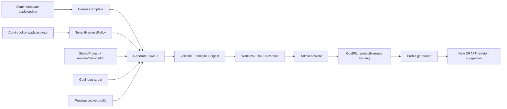

# Project Harness Profile

`ProjectHarnessProfile` is EvoPilot's project-level harness control-plane definition. It is long-lived, versioned, scoped to one tenant/workspace/project, and activated explicitly before it influences goal planning.

It answers a different question from a goal loop target:

| Concept | Question it answers |
|---|---|
| Goal loop target | What outcome should this project reach now? |
| ReleaseTargetProfile | What release thresholds and scenario evidence define the target? |
| Maturity Standards | What Alpha/Beta/RC/GA baseline must every governed goal keep? |
| HarnessTemplate | What public language/software-type baseline should this class of project inherit? |
| TenantHarnessPolicy | What private tenant/workspace constraints must all matching project profiles satisfy? |
| ProjectHarnessProfile | What project-specific capabilities, commands, evidence, failure handling, diagnostics, observability, and governance rules must every goal use? |

## Lifecycle



Fresh installs include multiple built-in `HarnessTemplate` baselines for Python enterprise projects, Java DDD services, Node SaaS control planes, Go middleware, observability/APM systems, and generic management software. Current built-ins are `@1.1.0` enterprise harness baselines with structured logs, exception tracking, trace correlation, SLO monitoring, alert routing, operational runbooks, language-specific diagnostics, and release evidence rules. Project onboarding automatically matches one published template from runtime/repository context and the goal loop target; an explicit template id is an administrator or advanced override.

Public templates are maintained as human-readable packs under `harness-templates/public/<template-id>/`, with `README.md`, `template.yaml`, `CHANGELOG.md`, and `examples/`. Administrators use the small pack CLI surface, `harness template pack list|validate|publish`, to validate and publish a pack into the server control plane. Direct YAML/JSON publishing with `harness template apply|update|upgrade` remains available for advanced cases. Template files are control-plane inputs with `id`, `version`, template sections, `sourceReferences[]`, and a current-version changelog. Reusing the same `id@version` requires explicit force; normal changes should publish a new version.

`TenantHarnessPolicy` is a separate private control layer scoped to one tenant/workspace. It is optional, but when active it is automatically applied to matching project profiles between the public template and the project-specific source. It can require organization-specific capabilities, evidence fields, correlation IDs, structured log fields, exception attributes, diagnostics, observability, governance booleans, and phase mappings. A project profile compiles as:

```text
HarnessTemplate + active TenantHarnessPolicy records + ProjectHarnessProfile source
```

Project-specific fields may add or specialize controls, but validation fails if they weaken active policy requirements. If a policy is activated after a profile version was compiled, profile activation and goal planning return `PROJECT_HARNESS_PROFILE_POLICY_STALE` until a reviewed profile revision binds the current policy version and digest.

Generated profiles are `DRAFT`. EvoPilot can use an LLM to draft them when a READY LLM profile exists; in debug mode without LLM it can create a deterministic template draft. Production `requireLlm=true` blocks generation if no READY LLM is configured.

Activation is the governance point. The server stores a profile version only after validation, and `activate` records the selected version as `ACTIVE` while marking the old active version `SUPERSEDED`.

## Storage

The control plane is authoritative. Repository files are import sources only.

Current file-store path:

```text
<dataRoot>/project-harness-profiles/<tenantId>/<workspaceId>/<projectId>/<profileId>/versions/v<version>.json
<dataRoot>/tenant-harness-policies/<tenantId>/<workspaceId>/<policyId>/versions/v<version>.json
```

The stored version contains:

- `sourceContent`: the YAML/JSON source profile normalized by the server.
- `sourceDigest`: digest of the source profile.
- `compiledContent`: template defaults plus active tenant/workspace policy constraints plus project overrides.
- `compiledDigest`: digest used by goal plans.
- `templateRef`: `templateId`, `version`, and `digest`.
- `policyRefs`: active tenant/workspace policy ids, versions, and digests that the compiled profile inherited.
- `validation`: checks, blockers, warnings.
- `diffFromActive`: changed sections against the previous active version.
- `generatedBy`: `user`, `llm`, or `deterministic-template`.

## Module Mapping

Admins can call:

```bash
evopilot harness profile explain default --project <project-id> --json
```

The explain projection maps profile sections to EvoPilot modules:

| Module | Profile sections |
|---|---|
| Project onboarding | `tenantId`, `workspaceId`, `projectId`, `templateRef`, `policyRefs` |
| Goal target planner | `capabilities`, `validation`, `phaseMapping`, `governance` |
| Executor and runtime | `runtime`, `rules` |
| Evidence contract | `evidence`, `validation` |
| Failure handling and diagnostics | `failureHandling`, `diagnostics` |
| Observability | `observability` |
| Release governance | `governance`, `phaseMapping`, `llmDraftPolicy` |

Users should not need to inspect scattered feature configuration files to understand the harness. The profile is the reviewable control-plane surface; module-specific code consumes the compiled profile.

## Goal Planning Binding

When a profile is active, `POST /api/v1/goals/{goalId}/plan` binds it into the generated plan:

```json
{
  "projectHarness": {
    "schema": "evopilot-goal-plan-project-harness-binding/v1",
    "profileId": "default",
    "version": 1,
	    "templateRef": {
	      "templateId": "python-enterprise-harness",
	      "version": "1.1.0",
	      "digest": "sha256:..."
	    },
	    "policyRefs": [
	      {
	        "policyId": "default",
	        "version": 1,
	        "digest": "sha256:...",
	        "scope": "tenant-workspace"
	      }
	    ],
	    "sourceDigest": "sha256:...",
    "compiledDigest": "sha256:...",
    "capabilities": ["source-boundary", "python-runtime", "release-governance"]
  }
}
```

This makes the plan reproducible. A later profile activation does not rewrite the already generated plan; a new goal plan must be generated to bind the new profile digest.

## Governance Rules

Project profiles may strengthen or bind real project commands, but they cannot weaken template mandatory gates:

- `tenantWorkspaceScopeRequired`
- `targetPlanRequiresApproval`
- `profileActivationRequiresApproval`
- `promotionRequiresReleaseDecision`
- `sourceClosureRequired`
- `noSilentProfileMutation`

If a goal execution reveals a missing harness capability, EvoPilot should create a revision suggestion or DRAFT profile version. It must not silently mutate the active profile.
