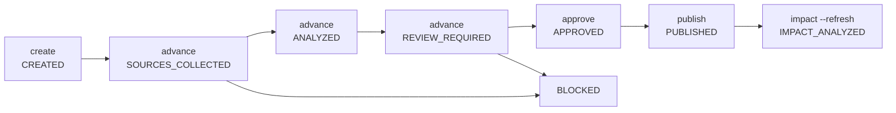

# HarnessTemplate Evolution

`HarnessTemplateEvolution` is the administrator control-plane lifecycle for upgrading public harness templates from reviewable knowledge sources. It is separate from daily project onboarding and from direct YAML/JSON template publishing.

Use it when an administrator wants EvoPilot to ingest notes, websites, GitHub repositories, existing templates, or local packs, generate a reviewed draft, validate it, publish a new `HarnessTemplate` version, and report which active project profiles are stale.

## Lifecycle



The server owns every transition. The CLI is only an HTTP adapter and does not compile, approve, or publish templates locally.

## Source Types

Supported source inputs:

| CLI input | Stored source type | First-stage behavior |
|---|---|---|
| `--source url=https://...` or `--url https://...` | `web-url` | Fetches text or strips HTML; stores HTTP metadata and warnings. |
| `--source github=owner/repo#ref` or `--github owner/repo#ref` | `github-repo` | Reads repository README candidates from `raw.githubusercontent.com`; full repository crawling is not first-stage behavior. |
| `--source gitlab=group/project#ref` | `gitlab-repo` | Stores the source; semantic extraction requires provided text or attachment in the first stage. |
| `--source local-pack=<path>` or `--local-pack <path>` | `local-pack` | Reads pack `README.md`, `template.yaml`, `CHANGELOG.md`, and examples into one source. |
| `--file <path>` or `--source file=<path>` | `attachment` | Text-like files are extracted; binary PDF/PPT/DOCX files record digest and warning without semantic extraction. |
| `--source template=<id>@<version>` or `--existing-template <id>@<version>` | `existing-template` | Reads an existing server-side template version. |
| `--source runtime-evidence=<id>` or `--runtime-evidence <id>` | `runtime-evidence` | Records a runtime evidence or evidence-bundle reference for review; first-stage semantic extraction requires attached text or notes. |
| `--note <text>` or `--source note=<text>` | `admin-note` | Stores the administrator note as reviewable source text. |

## Admin Flow

Create the run:

```bash
evopilot harness template evolution create \
  --base-template python-enterprise-harness \
  --target-version 1.1.5 \
  --intent "Add stronger Python exception tracking, observability, and AI troubleshooting metadata." \
  --source github=fastapi/fastapi#master \
  --source url=https://opentelemetry.io/docs/languages/python/ \
  --source runtime-evidence=release-evidence-2026-08-python \
  --file ./workspace-observability-notes.md \
  --note "Require requestId, traceId, errorCode, and nextAction in error logs." \
  --json
```

Advance until `REVIEW_REQUIRED`:

```bash
evopilot harness template evolution advance <evolution-id> --json
evopilot harness template evolution advance <evolution-id> --json
evopilot harness template evolution advance <evolution-id> --llm-profile platform-harness-llm --json
```

The first advance collects immutable snapshots and digests. The second advance extracts capability/runtime/evidence/failure/observability/governance signals. The third advance generates the draft. If a READY LLM profile exists, EvoPilot can use it to produce structured JSON; without LLM in debug mode, EvoPilot produces a deterministic draft. Production `--require-llm` blocks when no READY LLM profile is available.

Review the draft before approving. Important fields:

```text
evolution.draft.template
evolution.draft.pack.readme
evolution.draft.pack.templateYaml
evolution.draft.pack.changelog
evolution.draft.pack.examples
evolution.draft.validation
evolution.draft.diffFromBase
evolution.draft.sourceCoverage
evolution.draft.generatedBy
```

Approve and publish only after review:

```bash
evopilot harness template evolution approve <evolution-id> \
  --confirmed-by platform-admin \
  --confirmation "Reviewed draft template, validation, source coverage, and project impact." \
  --json
evopilot harness template evolution publish <evolution-id> --json
evopilot harness template evolution impact <evolution-id> --refresh --json
```

LLM output is draft-only. Publishing requires `APPROVED`, repeats server-side template validation, writes the new `HarnessTemplate` version, records audit evidence, and creates an impact report.

## Storage

Current file-store path:

```text
<dataRoot>/harness-template-evolutions/<evolutionId>/run.json
<dataRoot>/harness-template-evolutions/<evolutionId>/sources/<sourceId>.json
<dataRoot>/harness-template-evolutions/<evolutionId>/snapshots/<snapshotId>/snapshot.json
<dataRoot>/harness-template-evolutions/<evolutionId>/snapshots/<snapshotId>/extracted.txt
<dataRoot>/harness-template-evolutions/<evolutionId>/drafts/<draftId>/README.md
<dataRoot>/harness-template-evolutions/<evolutionId>/drafts/<draftId>/template.yaml
<dataRoot>/harness-template-evolutions/<evolutionId>/drafts/<draftId>/CHANGELOG.md
<dataRoot>/harness-template-evolutions/<evolutionId>/drafts/<draftId>/examples/default-project-profile.yaml
<dataRoot>/harness-template-evolutions/<evolutionId>/impact/report.json
```

These files are review and evidence artifacts. The published template remains the server-side `HarnessTemplate` control-plane record under `<dataRoot>/harness-templates/<templateId>-<version>.json`.

## Project Impact

Template evolution does not mutate active project profiles. After publishing, EvoPilot reports matching `ProjectHarnessProfile` records. Active profiles that still point at an older template version or digest are counted as stale; matching profiles without an active version are returned as `NO_ACTIVE_PROFILE` but are not counted as stale:

```text
impactReport.affectedProjectProfiles[]
impactReport.staleProfileCount
nextAction=generate-project-harness-profile-upgrade-drafts
```

New projects automatically match the latest suitable published template during `harness profile generate`. Existing projects must go through a reviewed profile regeneration or `harness profile upgrade`, then explicit activation, before new goal plans bind the new template digest.

## Logs

Harness template evolution emits structured `evopilot-log/v1` records with `category=harness` and events:

```text
harness-template-evolution.created
harness-template-evolution.advanced
harness-template-evolution.published
harness-template-evolution.impact-analyzed
```

AI agents should correlate by `requestId` plus `metadata.evolutionId`, `metadata.sourceIds`, `metadata.snapshotDigests`, `metadata.baseTemplateId`, `metadata.baseTemplateVersion`, `metadata.targetTemplateId`, `metadata.targetVersion`, `metadata.draftDigest`, `metadata.validationStatus`, `metadata.validationBlockers`, `metadata.publishedTemplateDigest`, `metadata.staleProfileCount`, `metadata.blockers`, `metadata.warnings`, and `metadata.nextAction`.

Use `evopilot logging inspect --json` to check the server log level. An administrator may temporarily set `debug` while diagnosing a blocked evolution, then restore `info`.
